# What are this?

This is Yaafr, Yet Another AVR Fusebit Rescuer. It is large because of all the ZIF-sockets and does not even feature any mounting holes. It also has two IDC headers for expanding to programming clips or other adapters to rescue non-dip AVR microcontrollers.

It is be able to restore wrongly fused or locked AVR microcontrollers that support high voltage parallel (HVPP) programming or high voltage serial programming (HVSP).

This circuit has been inspired by these projects:

[RescueAVR](https://github.com/felias-fogg/RescueAVR) by Bernhard.\
[AVR Fuse Rescue Shield for Arduino Uno](https://github.com/4x1md/avr_frs_shield) by Dmitry Melnichansky.\
[Arduino-based AVR High Voltage Programmer](https://mightyohm.com/blog/2008/09/arduino-based-avr-high-voltage-programmer/) by Jeff Keyzer.\
[Atmega Fusebit Doctor](https://web.archive.org/web/20180225102717/http://mdiy.pl/atmega-fusebit-doctor-hvpp/?lang=en) by Paweł Kisielewski.

Firmware update 2.11 from the Atmega Fusebit Doctor for the atmega328p has been tested and is working. The [original site](https://files.elektroda.pl/437268,atmega-hvpp-fusebit-doctor_update11.html) does not exist anymore, but [SukkoPera](https://github.com/SukkoPera) has been so kind to archive the remains: https://github.com/SukkoPera/avr-fusebit-doctor/

Firmware from RescueAVR in FBD_MODE works also, but may not contain support for all the chips (such as the AT90S1200).

# Status

This project is working for me, I can rescue all my locked AVRs. See below for what I have tested and validated to be working.

While the schematic was carefully made, the PCB has not been fully tested yet.

I added the possibility to switch on and off AGND and AVCC because in many datasheets in one instance they must be connected and in the next they must not, however leaving the switches always on connected when it does not need to be then the rescues seem to work just fine.

# Checklists

## Functionality

| Thing                                         | Tested and working?       |
| --                                            | --                        |
| 40-pin DIP style A                            | :ballot_box_with_check:   |
| 40-pin DIP style B                            | :ballot_box_with_check:   |
| 28-pin DIP style A                            | :ballot_box_with_check:   |
| 20-pin DIP style A                            | :ballot_box_with_check:   |
| 20-pin DIP style B                            | :ballot_box_with_check:   |
| 14-pin DIP style A                            | :ballot_box_with_check:   |
| 8-pin DIP style A                             | :ballot_box_with_check:   |
| AVR Atmega fusebit doctor firmware 2.11       | :ballot_box_with_check:   |
| RescueAVR firmware                            | :ballot_box_with_check:   |
| Serial connection                             | :ballot_box_with_check:   |
| Fusebit doctor compatible expansion header    | :black_square_button:     |
| HVPP expansion header                         | :black_square_button:     |
| HVSP expansion header                         | :black_square_button:     |

## 40-pin DIP style A (AT90S8535)

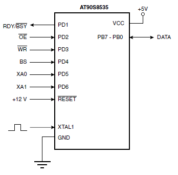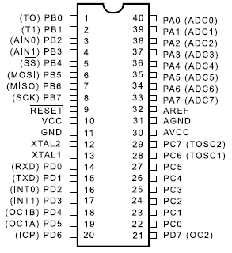

| Model         | Signature         | Working                   |
| --            | --                | --                        |
| AT90S8535     | 0x1E 0x93 0x03    | :ballot_box_with_check:   |
| ATmega8535    | 0x1E 0x93 0x08    | :ballot_box_with_check:   |
| ATmega163     | 0x1E 0x94 0x02    | :ballot_box_with_check:   |
| ATmega323     | 0x1E 0x95 0x01    | :ballot_box_with_check:   |
| ATmega16A     | 0x1E 0x94 0x03    | :ballot_box_with_check:   |
| ATmega32A     | 0x1E 0x95 0x02    | :ballot_box_with_check:   |
| ATmega324A    | 0x1E 0x95 0x15    | :ballot_box_with_check:   |
| ATmega644PA   | 0x1E 0x96 0x0A    | :ballot_box_with_check:   |
| ATmega1284P   | 0x1E 0x97 0x05    | :ballot_box_with_check:   |

## 40-pin DIP style B (AT90S8515)

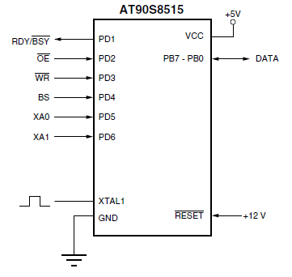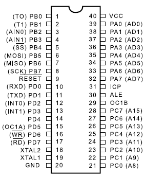

| Model         | Signature         | Working                   |
| --            | --                | --                        |
| AT90S4414     | 0x1E 0x92 0x01    | :ballot_box_with_check:   |
| AT90S8515     | 0x1E 0x93 0x01    | :ballot_box_with_check:   |
| ATmega8515    | 0x1E 0x93 0x06    | :ballot_box_with_check:   |
| ATmega161     | 0x1E 0x94 0x01    | :ballot_box_with_check:   |
| ATmega162     | 0x1E 0x94 0x04    | :ballot_box_with_check:   |

## 28-pin DIP style A (AT90S2333)

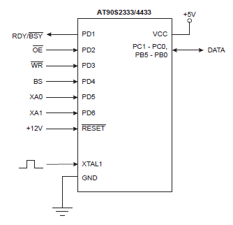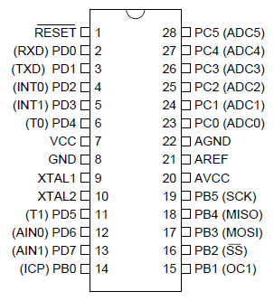

| Model     | Signature         | Working                   |
| --        | --                | --                        |
| AT90S2333 | 0x1E 0x91 0x05    | :ballot_box_with_check:   |
| AT90S4433 | 0x1E 0x92 0x03    | :ballot_box_with_check:   |
| ATmega8   | 0x1E 0x93 0x07    | :ballot_box_with_check:   |
| ATmega48  | 0x1E 0x92 0x05    | :ballot_box_with_check:   |
| ATmega88  | 0x1E 0x93 0x0A    | :ballot_box_with_check:   |
| ATmega168 | 0x1E 0x94 0x06    | :ballot_box_with_check:   |
| ATmega328 | 0x1E 0x95 0x14    | :ballot_box_with_check:   |
| ATtiny48  | 0x1E 0x92 0x09    | :ballot_box_with_check:   |
| ATtiny88  | 0x1E 0x93 0x11    | :ballot_box_with_check:   |

## 20-pin DIP style A (AT90S1200)

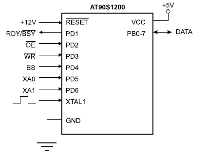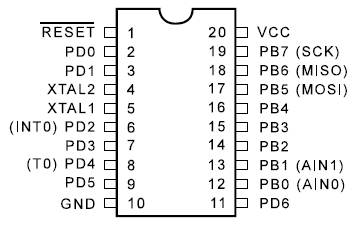

| Model         | Signature         | Working                   |
| --            | --                | --                        |
| AT90S1200     | 0x1E 0x90 0x01    | :ballot_box_with_check:   |
| AT90S2313     | 0x1E 0x91 0x01    | :ballot_box_with_check:   |
| ATtiny2313    | 0x1E 0x91 0x0A    | :ballot_box_with_check:   |
| ATtiny2313A   | 0x1E 0x91 0x0A    | :ballot_box_with_check:   |
| ATtiny4313    | 0x1E 0x92 0x0D    | :ballot_box_with_check:   |

## 20-pin DIP style B (ATtiny26)

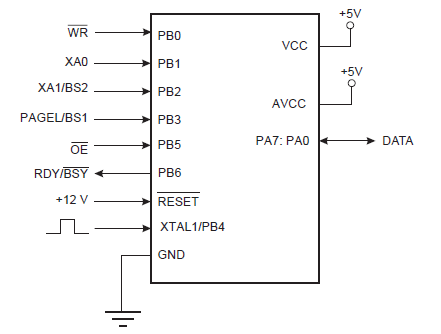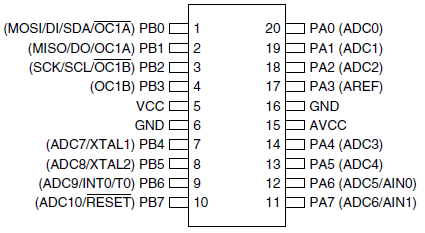

| Model         | Signature         | Working                   |
| --            | --                | --                        |
| ATtiny26      | 0x1E 0x91 0x09    | :ballot_box_with_check:   |
| ATtiny261A    | 0x1E 0x91 0x0C    | :ballot_box_with_check:   |
| ATtiny461     | 0x1E 0x92 0x08    | :ballot_box_with_check:   |
| ATtiny461A    | 0x1E 0x92 0x08    | :ballot_box_with_check:   |
| ATtiny861A    | 0x1E 0x93 0x0D    | :ballot_box_with_check:   |

## 14-pin DIP style A (ATtiny24)

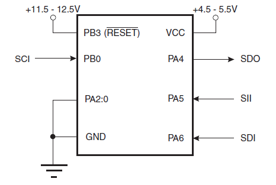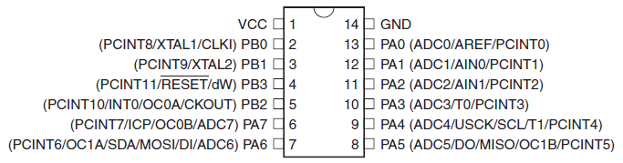

| Model     | Signature         | Working                   |
| --        | --                | --                        |
| ATtiny24  | 0x1E 0x91 0x0B    | :ballot_box_with_check:   |

## 8-pin DIP style A (AT90S2323)

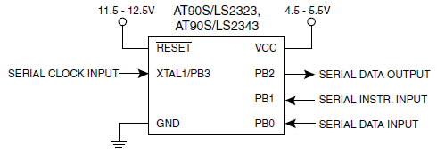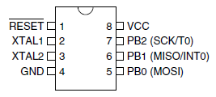

| Model     | Signature         | Working                   |
| --        | --                | --                        |
| AT90S2323 | 0x1E 0x91 0x02    | :ballot_box_with_check:   |
| AT90S2343 | 0x1E 0x91 0x03    | :ballot_box_with_check:   |
| ATtiny12  | 0x1E 0x90 0x05    | :ballot_box_with_check:   |
| ATtiny15  | 0x1E 0x90 0x06    | :ballot_box_with_check:   |
| ATtiny13  | 0x1E 0x90 0x07    | :ballot_box_with_check:   |
| ATtiny25  | 0x1E 0x91 0x08    | :ballot_box_with_check:   |
| ATtiny45  | 0x1E 0x92 0x06    | :ballot_box_with_check:   |
| ATtiny85  | 0x1E 0x93 0x0B    | :ballot_box_with_check:   |

# Errata

## PCB V1.1

- No known erratum, however this pcb version has not been made yet.

## PCB V1.0

- 10.16mm wide 28-pin ZIF socket X3 seems to be unobtanium. Changed for 7.62mm wide 'narrow' 28-pin zif socket in V1.1 pcb.

